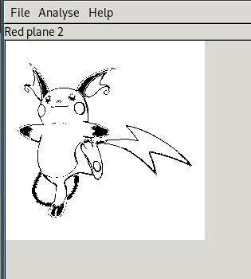
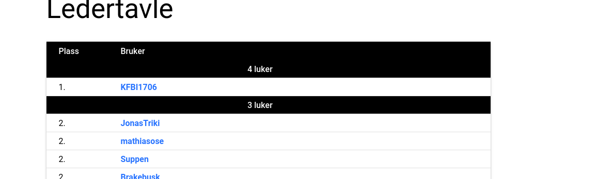

# Day 4 - Stego you say?

Having participated in a couple of CTFs the last year I've picked up on the correct tools to use for stego challs. Don't get me wrong, I'm not good at stego, I just know of many tools which I just iterated through depending on the kind of task.

This time it was a png, so I opened it in OpenStego and there in the red-channel, and all the other channels for that matter Raichu was visible.

It was fun to be first on the leaderboards for once :)  

