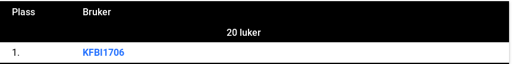

# Day 20 - FIRST!

Today was a fun day. I managed to be first and use some cool Go concepts along the way. And I think this is an example of a task where Go really shines. You can do fairly complicated stuff, while everything is still readable and it's all easy to write.

The cool thing I did today was that I created my own struct as I needed the original string, the repeating string and lastly the index for sorting. And then I just needed to define three functions for that struct and then I was able to sort it like any other list, that's so easy!

Even though this task wasn't very hard the fact that you can create a custom type just like you want it and define sorting behavior in such an easy and understandable way is really cool. I have to say this is really interesting especially in the context of generics, but that will be a discussion for another day.

I went over the code and commented the important parts, enjoy!

